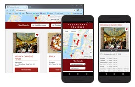
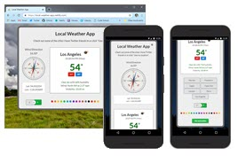
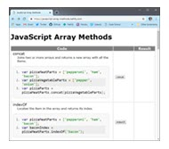

<!-- markdownlint-disable MD022 MD032 MD033 -->

<h1>James Priest</h1>
Los Angeles, CA
<a href="mailto:james-priest@outlook.com">james-priest@outlook.com</a>

---

    <a href="https://github.com/james-priest" title="GitHub Profile" target="_blank"><i class="fa fa-github" style="font-size: 20px"></i>&nbsp;GitHub</a>
    <a href="https://codepen.io/james-priest" title="CodePen Profile" target="_blank"><i class="fa fa-codepen" style="font-size: 20px"></i>&nbsp;CodePen</a>
    <a href="https://www.linkedin.com/in/jamespriestdeveloper/" title="LinkedIn Profile" target="_blank"><i class="fa fa-linkedin-square" style="font-size: 20px"></i>&nbsp;LinkedIn</a>
    <a href="https://twitter.com/james_priest1" title="Twitter Profile" target="_blank"><i class="fa fa-twitter-square" style="font-size: 20px"></i>&nbsp;Twitter</a>
    <a href="https://www.freecodecamp.com/james-priest" title="freeCodeCamp Profile" target="_blank"><i class="fa fa-free-code-camp" style="font-size: 20px"></i>&nbsp;freeCodeCamp</a>
    <a href="https://www.instagram.com/jamespub" title="Instagram Account" target="_blank"><i class="fa fa-instagram" style="font-size: 20px"></i>&nbsp;Instagram</a>
    <a href="./assets/docs/JamesPriest_Resume.pdf" title="PDF Resume" target="_blank"><i class="fa fa-file-pdf-o" style="font-size: 20px"></i>&nbsp;Resume</a>
    <!--<a href="#" title="Not yet, but soon.😊" target="_blank"><i class="fa fa-medium fa-lg" aria-hidden="true"></i>&nbsp;Medium</a>-->

<!--

---

## Table of Contents

- [Table of Contents](#table-of-contents)
- [Objective](#objective)
- [Skills](#skills)
- [Career History](#career-history)
  - [Full-time Student](#full-time-student)
  - [Personal Time Off](#personal-time-off)
  - [Velodea](#velodea)
  - [devAware Technology Solutions](#devaware-technology-solutions)
  - [The Velodea Group](#the-velodea-group)
  - [Microsoft Corporation](#microsoft-corporation)
  - [Phillips Research Laboratory](#phillips-research-laboratory)
  - [Intel Corporation](#intel-corporation)
- [Portfolio](#portfolio)
- [Documentation](#documentation)
- [Education](#education)
- [Certifications](#certifications)
- [Training](#training)
- [Achievements](#achievements)
- [My Story](#my-story)
- [Social Media](#social-media)
-->

---

## Objective

Full Stack Developer with 20 years experience seeking to join a thriving and dynamic company who's focused on building next generation, line-of-business web and mobile applications.

---

## Skills

<!--
| Languages | Technologies | Servers |
| --- | --- | --- |
| * HTML5 | * ASP.NET | * IIS |
| * CSS3 | * .NET Core | * Azure |
| * JavaScript | * something | * GitHub |
| * Git CLI | * C# | * Visual Studio (2017 & Code) |
-->

| Development Skills |   |
| :--- | :--- |
| React, Redux, & JAMStack Architecture | Complete Responsive Web Design |
| Progressive Web App & Offline Development | Web Accessibility & ARIA Compliance |
| UI/UX, IA, & Standards Design | Web Automation & Build Systems |
| .NET Web Application Development | RDBMS & NoSQL DB Design & Development |

<!-- 
| Offline Web Applications | Web Automation & Build Systems |
| .NET Web Application Development | SQL Server/MySQL DB Design & Programming |
| Multi-tier Object Oriented Design | Responsive Web Design |
| Web Accessibility & ARIA | UI/UX, Information Architecture, Standards Design |
 -->

| Languages |  Web, Frameworks, & Database | IDEs & Cloud Environments |
| :-------- | :----------- | :---------      |
| JavaScript ES5/ES6 | React / Redux / React Native | VS Code / Visual Studio / DevTools |
| HTML5 / CSS3 | IndexedDB / Cache API / Fetch API | Git / GitHub / GitHub Pages |
| C# | ASP.NET / .NET Framework | Azure DevOps / Heroku / Netlify |
| VB.NET | SQL / Stored Procedures / Transactions  | Azure Cloud (Win & Linux VMs) |

| Stack Capabilities |
| :-- |
| Front End Development | Back End Development  | Database Design |

| Additional Technical Skills |
| :-- |
| Node.js, Npm, Gulp, Grunt, Jekyll, MarkDown, MS SQL Server, MySQL, SQLite, MongoDB Query Syntax, Bootstrap, jQuery, Semantic-UI, Sematic UI React, Service Workers, Web Workers |

| Non-technical Skills |
| :-- |
| Marketing, Project Management, Account & Client Management, Documentation & Technical Writing |

**[⬆ top](#james-priest "toc")**

---

## Career History
In 2014 my last employer went out of business. I took that opportunity to spend with family and went back to school in 2017 to re-educate myself on the latest mobile, web, and app technologies.

I graduated in 2018 with a [Nanodegree in Mobile Web Development](https://confirm.udacity.com/3JM7SK4Q) from Udacity and will be receiving a second [Nanodegree in React, Redux, & React Native Frameworks](https://www.udacity.com/course/react-nanodegree--nd019) in May of 2019.

I am excited to re-enter the workforce and apply my knowledge toward building cutting-edge technology solutions.

Following is my career history up until this point.

| 1. [Velodea](#career--velodea "toc") | 4. [Microsoft Corporation](#career--microsoft-corporation "toc") |
| 2. [devAware Tech Solutions](#career--devaware-technology-solutions "toc") | 5. [Phillips Research Laboratory](#career--phillips-research-laboratory "toc") |
| 3. [The Velodea Group](#career--the-velodea-group "toc") | 6. [Intel Corporation](#career--intel-corporation "toc") |

<!-- 

### Full-time Student

<table>
  <thead>
    <tr>
      <th style="text-align: left">&nbsp;</th>
      <th style="text-align: right">January 2017 - present</th>
    </tr>
  </thead>
</table>

Starting in 2017, I began a series of full-time, online courses related to web & mobile development. I completed [more than 30 in the first year](#training "toc") from such providers as Pluralsight, Code School, Microsoft Virtual Academy, & Free Code Camp.

In the second year I was awarded two separate scholarships from Udacity. These were:

- Grow with Google Scholarship Challenge for Mobile Web Development (3-month program)
- Mobile Web Specialist by Google Nanodegree (6-month program)

Upon completion I received my Udacity [Nanodegree as a Mobile Web Specialist](#certifications "toc") .

**[⬆ top](#james-priest "toc")**

---

### Personal Time Off

<table>
  <thead>
    <tr>
      <th style="text-align: left">&nbsp;</th>
      <th style="text-align: right">June 2014 - December 2016</th>
    </tr>
  </thead>
</table>

I took time to spend with family after shutting down the company I had worked for during the previous eight years. This closing was due to the untimely passing of our Managing Director.

**[⬆ top](#james-priest "toc")**

--- -->

### Velodea

|      | April 2006 - June 2014 |
| :--- | ---: |
| Technology Director & Development Lead | Pasadena, California |

Serving as technology lead and .NET expert for this digital marketing agency, I’ve had the opportunity to shape and develop hundreds of website solutions utilizing a wide variety of platforms, technologies, and programming languages. Notable projects include:

- **Beechcraft Corporation** ([beechcraft.com](http://www.beechcraft.com/special_missions/ "Special Missions page")) – As a direct extension of Beechcraft IT, duties included web application development, database design and content management. Responsible for building and maintaining entire Beechcraft corporate website as well as many applications to support the Sales and Marketing process. 
_Technologies Used:_ **ASP.NET, VB.NET, C#, database design, SQL Server, stored procs, Bootstrap, HTML, CSS, JavaScript, jQuery**

- **Flex Ed** ([flexed.com](http://flexed.com/classes.php "Class Calendar page")) – Designed and developed a large-scale Learning Management System (LMS) to handle line-of-business functions including course creation, scheduling, enrollment, and reporting as well as many other work-flow automation tasks. The system currently tracks progress of 85,000 students, handles scheduling for over 100 hospitals, and employs modules for instructors and coordinators to manage rosters and certifications. 
_Technologies Used:_ **Linux/Apache, PHP/MySQL, HTML, CSS, jQuery, stored procedures, triggers, MySQL functions**

- **Shell Eco-marathon Live Event** ([shell.com/eco-marathon](http://www.shell.com/energy-and-innovation/shell-ecomarathon/about.html "Eco-marathon about page")) – The project involved the creation of a social & streaming media website to serve as a hub for coverage of Shell’s multi-national Eco-marathon event. The site provided twitter feeds, event video, on-line polls, and contest standings. The event was streamed live through our CDN utilizing real-time encoding. 
_Technologies Used:_ **PHP/My SQL, Live Video Streaming, JavaScript APIs (Facebook, Twitter, Flickr). HTML, CSS, JavaScript, jQuery**

<!-- - **Favorite Top 10** (retired) – This “proof-of-concept” Social Media application was built for use on Facebook as well as 70 other social media and blog sites. The widget was developed using Flex, PHP and MySQL.  XML over HTTP was used for the communication layer. The website also employs various JavaScript libraries for rich UI capability. 
_Technologies Used:_ **Flex, ActionScript, PHP/MySQL, XML, HTML, CSS, Prototype, Scriptaculous** -->

- **REZA Investment Group** ([rezacompanies.com](http://rezacompanies.com "Reza Companies homepage")) – Approached by REZA companies to build a custom SalesForce implementation and website frontend to automate the sales process of high-end real-estate listings. This involved extending SalesForce through custom programming and exchanging information through extensive use of web APIs. 
_Technologies Used:_ **PHP/My SQL, Live Video Streaming, JavaScript APIs (Facebook, Twitter, Flickr). HTML, CSS, jQuery**

- **J. Walter Thompson** ([Shell Passionate Experts](https://www.adforum.com/agency/4333/creative-work/34468969/kurt-bush/shell "Interactive site & marketing campaign is no longer active")) – Responsible for developing an interactive Flash site to promote Shell’s Passionate Experts campaign. The project incorporated use of various ActionScript 3 libraries, streaming video, keyed green screen footage and programmatic Flash animation as well as customized H.264 video encodings. 
_Technologies Used:_ **Flash, ActionScript, FMS streaming, AfterEffects, 3D Studio Max, Media Encoder, F4V H.264 encoding**

- **ABC Studios Live Stream** - ABC Studios engaged Velodea to design and build a streaming media system that would allow executives and other stakeholders the ability to tap into camera feeds at each remote sound stage location to view filming of various shows in real-time. The system developed was a custom combination of hardware and software encoders that could transcode to both Windows Media and Flash Media video which could be accessed through a secured website. 
_Technologies Used:_ **ASP.NET, C#, Flash, ActionScript, FMS & WMS streaming, Flash Live & Windows Media Encoders, F4V & WMV format encoding**

**[⬆ top](#james-priest "toc")**

---

### devAware Technology Solutions

|      | July 2002 - March 2006 |
| :--- | ---: |
| Founder & Lead Developer | La Canada, California |

devAware specialized in .NET & Windows DNA application development for the web and desktop. As founder and lead developer, my role was that of information architect, systems designer & application developer. Some notable projects include:

- **Sony VIAO Kiosk** - Contracted to create a custom installation for all Sony VIAO display models at Best Buy, Circuit City, Good Guys and Fry’s Electronics stores. The system locked down the OS through registry and group policy modifications while still allowing customer interaction with the desktop and Sony apps. Usage statistics were logged, uploaded and accessed through secure login. 
_Technologies Used:_ **ASP.NET, ADO.NET, VB.NET, Win32, VB COM objects, SQL Server, IIS, Windows registry customization**

- **Xtreme Desktops Applications** - Engaged to develop an application framework for a series of Flash-based desktop experiences. Components consisted of **.NET HTTP server** applications to gather usage statistics for upload to a centralized analytics server. Responsible for custom built Analytics system and test environment utilizing **IIS** with **ASP.NET** and **SQL Server**. Lab consisted of **Win 2000, ME, XP Home, XP Pro, Win 2000 server & 2003 server** for complete unit and regression testing of each version of the desktop application. Over 50 branded applications were created and posted for distribution. Each desktop application was part of a marketing campaign to promote the following major motion picture & television series:

  |  |  |  |
  | :--- | :--- | :--- |
  | • X-Men – The Last Stand | • The Fast and the Furious | • Fantastic 4 |
  | • The Family Guy | • Alien: Director Cut | • National Treasure |
  | • Alexander | • 24 _Season 1-3_ | • X2 – _X-Men United_ |

  _Technologies Used:_ **VB.NET, ADO.NET, VB COM objects, InstallShield scripting, IIS, SQL Server, testing lab methodologies**

**[⬆ top](#james-priest "toc")**

---

### The Velodea Group

|      | July 2000 - July 2002 |
| :--- | ---: |
| Director of Corporate IT & Lead Developer | Milan, Italy / Los Angeles, California |

As lead developer and director of The Velodea Group’s Velotek division, job responsibilities spanned an array of IT related areas including web application development, systems architecture and network infrastructure. Velotek’s primary role consisted of developing web-based product offerings and creating technical solutions for clients.

<!--TODO: bullet point out  3 Velodea projects -->
<!-- * **VeloTrack Web Analytics** -
This project provided web metrics before Google Analytics existed. This was done by collecting traffic, browser & usage data through the inclusion of an invisible gif on each email and web page to be tracked. All reports were custom built and allowed advanced customization.

* **CodeSigning for Kareem** - 
This project consisted of... -->

- **VeloTrack (Site Management and Behavioral Analysis System)** – VeloTrack was a custom-built solution that integrated seamlessly with websites to offer behavioral tracking, email list management, registration, surveying, and demographic-based site usage reporting.  VeloTrack boasted the ability to capture millions of page views per day in a manner completely transparent to the end user.  The system was designed to be highly customizable as well as intuitive in order to allow non-technical clients the ability to generate reports as well as create surveys and construct email marketing campaigns.  All data was also available through HTTP as a Web API for integration into client applications. 
**This was a modularized system developed over two years which consisted of equal parts Google Analytics, Constant Contact, Mail Chimp, WordPress & Salesforce before those systems came into being.**

- **VeloTeam (Asset Management Extranet System)** – Velodea’s extranet system managed all documents and materials related to a project while facilitating communication and collaboration between project teams and clients.  Highly customizable document repositories organized and managed all project-based assets.  Additionally, the system managed user accounts, tracked incident resolutions and sent automated email notification to the team when new material was made available to the site.  Use of this system had reduced cost and dramatically increased productivity by shortening the development life cycle of Velodea’s projects.  Over 100 customized instances were rolled out for clients such as Sony, Miramax, Qualcomm, and Toshiba. 
**This was a system that provided the capabilities of Basecamp, DropBox, JIRA, and GitHub. It offered project management, document sharing, version control, bug tracking/issue resolution & client communications at a time when those services didn't exist out in the wild.**

_Technologies Used:_ **ASP, JavaScript, HTML, CSS, SQL, VB, COM, XML; DevOps for Windows Server, Exchange Server & SQL Server platforms & Active Directory Networks.**

**[⬆ top](#james-priest "toc")**

---

### Microsoft Corporation

|      | November 1998 – June 2000 |
| :--- | ---: |
| Release Program Manager | Redmond, Washington |

As a key member of Microsoft’s Product Release team, responsibilities included application development, system design and project management for release of Microsoft product to the marketplace.  Projects driven and developed by myself included:

- **Release To Web System (RTW)** - This suite of applications was the primary release mechanism for product delivery to Microsoft.com worldwide.  The system boasted an average of 1000 releases per month and tracked workflow, sign-off, QA, and virus scan. All released bits were vaulted to a centralized repository within the Software Release Labs.  The application was designed entirely from the ground up to fulfill Microsoft’s need to release product in less than 3 hours.

- **PIRS University** - Product Information Release Services (PIRS) University was an online training center that provided company-wide services and computer-based training related to product release.  This site provided some of the following capabilities: automated content publication for non-technical business process owners, hierarchical management of heterogeneous data and online training registration for course offerings.  This site provided centralized management for what was previously a fragmented information base.

- **Media Shipment Tracking System (ShipInfo)** - The ShipInfo system gathered and tracked all software media shipments made to Microsoft’s third-party manufacturers.  This allowed manufacturing facilities to plan production cycles as well as track the progress of any shipment.  The system consisted of multiple SQL Server databases in each of Microsoft’s regions of operation.  These databases received shipment information through a web-based front end from each of the release labs. The data was then warehoused three times daily to coincide with the close of business at Microsoft’s American, European and Asian operating centers.  The warehoused data was then made available through the corporate extranet to vendors and manufacturers.

Each system was developed according to multi-tier design architecture standards and were built using **HTML, ASP, Visual Basic, JavaScript, VBScript, CSS, and SQL stored procedures**. Where possible, **MTS COM objects** were created for re-usability and programming practices followed a component-based object model.  Additional responsibilities ranged from systems analysis to solution implementation and included such things as **application prototyping, database design, user-interface design** and **technical, functional, and user documentation**.

**[⬆ top](#james-priest "toc")**

---

### Phillips Research Laboratory

|      | September 1997 – October 1998 |
| :--- | ---: |
| Web Application Developer | Albuquerque, New Mexico |

Hired as Lead Intranet Developer for the U.S. Air Force’s Phillips Research Lab at Kirtland Air Force Base.  Job functions involved design and implementation of all **web-based client/server applications** as well as **systems analysis, database programming and graphic design**. Technologies used included **ASP, SQL, Java** and **ActiveX development**. Also responsible for **NT, IIS, and SQL Server administration and configuration**.

**[⬆ top](#james-priest "toc")**

---

### Intel Corporation

|      | June 1997 – September 1997 |
| :--- | ---: |
| Web Application Developer | Rio Rancho, New Mexico |

Contracted to design and develop a web-based reporting system responsible for generating statistical information for Intel University. Utilized **ASP, SQL, and custom developed ActiveX DLLs**. The system was implemented worldwide upon its completion.

**[⬆ top](#james-priest "toc")**

---

## Portfolio

| --- | --- | --- |
|  **Restaurant Review App** |  **CSS Grid Learning App** |  **Weather Forecast App** |
|  **SpyCats Portfolio Site** |  **JavaScript Array Methods** |  **Quote Generator** |

- **Restaurant Review App** 
  This mobile-optimized Progressive Web App is
  - Fully responsive and ARIA compliant
  - Uses Service Worker, IndexedDB, & Cache API for a seamless offline experience
  - Synchronizes when a connection is available and notifies the user when offline
    
  
    
  [[Demo](https://restaurant-review-app.netlify.com)], [[Code Notes](https://james-priest.github.io/mws-restaurant-stage-1/)], [[Code Sample](https://github.com/james-priest/mws-restaurant-stage-1/blob/master/app/js/dbhelper.js)], [[GitHub Repo](https://github.com/james-priest/mws-restaurant-stage-1)]
    

- **CSS Grid Learning App** 
  This is JavaScript Single Page Application built as a proof-of-concept.
  - It teaches CSS Grid as a series of lessons.
  - It's built with vanilla JavaScript, CSS transitions, & extensive use of RegEx
  - Includes an in-page code editor built from scratch
    
    
  [[Demo](https://css-grid.netlify.com/?pg=12)], [[CodePen](https://codepen.io/james-priest/pen/MrdNPZ)], [[Code Sample](https://github.com/james-priest/grid-critters-code/blob/master/script/mce_ta.js)], [[GitHub Repo](https://github.com/james-priest/grid-critters-code)]
    

- **Weather Forecast App** 
  This is a single page app written to demonstrate JAMStack architecture.
  - It is written from scratch and is fully responsive
  - Uses Ajax,  HTML5 Geo-location, & embedded SVG
  - Uses Semantic-UI framework, Ajax, CSS animations, & transitions
    
  
    
  [[Demo](https://local-weather-app.netlify.com/)], [[CodePen](https://codepen.io/james-priest/pen/XaQQaO)], [[Code Sample](https://github.com/james-priest/local-weather-app/blob/master/js/ajax.js)], [[GitHub Repo](https://github.com/james-priest/local-weather-app)]
    

- **SpyCats Portfolio Site** 
  This app is a portfolio-style site. It was written to satisfy an FCC certification requirement.
  - It uses Bootstrap, jQuery, HTML5 Forms
  - It incorporates scroll navigation & semantic HTML
  - Is fully responsive and scales across devices
    
  
    
  [[Demo](https://spycats.netlify.com/)], [[CodePen](https://codepen.io/james-priest/pen/prpjEK)], [[Code Sample](https://github.com/james-priest/spy-cats/blob/master/js/fcc-portfolio.js)], [[GitHub Repo](https://github.com/james-priest/spy-cats)]
    

- **JavaScript Array Methods** 
  This app was built as part of my Microsoft Developer Certification study.
  - It uses Object Oriented ES5 JavaScript
  - It uses QUnit and TDD (Test-Driven Development) methodology
  - It dynamically builds an interface that models various JavaScript Array methods
    
  
    
  [[Demo](http://javascript-array-methods.netlify.com/)], [[Sample Code](https://github.com/james-priest/javascript-array-methods)], [[GitHub Repo](https://github.com/james-priest/javascript-array-methods)]
    

- **Random Quote Generator** 
  This app is FCC project built to satisfy a certification requirement.
  - It uses basic JavaScript & jQuery for API requests through Ajax
  - CSS transitions to dynamically display famous quotes
  - Embedded SVG & FontAwesome for icons and background
    
  
    
  [[Demo](https://random-quote-generator.netlify.com/)], [[CodePen](https://codepen.io/james-priest/pen/RZdGNo)] [[Code Sample](https://github.com/james-priest/random-quote-generator/blob/master/js/script.js)], [[GitHub Repo](https://github.com/james-priest/random-quote-generator)]
   

**[⬆ top](#james-priest "toc")**

---

## Documentation

- **React Nanodegree Project Notes** 
  Step-by-step walk-through of how I built each of my React Nanodegree capstone projects.
  - Project 1 - [MyReads](https://james-priest.github.io/reactnd-project-myreads/) 
    MyReads App allows users to search from a catalog of books and save choices to various books shelves. It's built with React & React Router.
  - Project 2 - [Would You Rather](https://james-priest.github.io/reactnd-project-would-you-rather/) 
    Would You Rather is a polling game that presents the user with a series of questions that can be answered one of two ways. It's built with React, Redux, React Router, & Redux Thunk.
- **React Nanodegree Course Notes** 
  Course Notes from the React Nanodegree course list.
  - React Nanodegree Notes - [Table of Contents](https://james-priest.github.io/udacity-nanodegree-react/index.html)
  - Section 1 - [React Fundamentals](https://james-priest.github.io/udacity-nanodegree-react/course-notes/react-fundamentals.html)
  - Section 2 - [React & Redux](https://james-priest.github.io/udacity-nanodegree-react/course-notes/react-redux.html)
- **Mobile Web Nanodegree Project Notes** 
  Step-by-step walk-through of how I built my capstone project. This is a fully responsive Restaurant Review Progressive Web App (PWA) with database, caching, & offline capabilities.
  - Table of Contents - [Restaurant Review App Code Notes](https://james-priest.github.io/mws-restaurant-stage-1/index.html)
  - Stage 1 - [Building a fully responsive & accessible web app](https://james-priest.github.io/mws-restaurant-stage-1/stage1.html)
  - Stage 2 - [Offline capability with Service Worker, Cache API, & IndexedDB](https://james-priest.github.io/mws-restaurant-stage-1/stage2.html)
  - Stage 3 - [Designing HTML5 forms, offline request queue, & performance tuning](https://james-priest.github.io/mws-restaurant-stage-1/stage3.html)
  - Stage 4 - [Launching live site with back end data services & front end build process](https://james-priest.github.io/mws-restaurant-stage-1/stage4.html)
- **100 Days of Code Log** 
  Tasks, challenges, and work samples related to web development over the last 18 months.
  - Log Round 1 - [June 2017 - January 2018](https://james-priest.github.io/100-days-of-code-log/)
  - Log Round 2 - [January 2018 - May 2018](https://james-priest.github.io/100-days-of-code-log-r2/)
  - Log Round 3 - [May 2018 - October 2018](https://james-priest.github.io/100-days-of-code-log-r3/)
  - Log Round 4 - [October 2018 - February 2019](https://james-priest.github.io/100-days-of-code-log-r4/)
  - Log Round 5 - [February 2019 - present](https://james-priest.github.io/100-days-log/log5.html)
- **Microsoft Programming in HTML5 with JavaScript and CSS3 Study Notes** 
  Notes related to my studies for the MS 70-480 certification exam.
  - Chapter 6 - [JavaScript Objects](https://github.com/james-priest/javascript-objects)
  - Chapter 10 - [WebSocket Communications](https://james-priest.github.io/100-days-of-code-log-r2/CH10-WebSocket.html)
  - Chapter 11 - [HTML5 Media](https://james-priest.github.io/100-days-of-code-log-r2/CH11-HTML5-Media.html)
  - Chapter 12 - [HTML5 Canvas](https://james-priest.github.io/100-days-of-code-log-r2/CH12-Canvas.html)
  - Chapter 13 - [HTML5 Drag and Drop](https://james-priest.github.io/100-days-of-code-log-r2/CH13-Drag-Drop.html)
  - Chapter 14 - [HTML5 Geolocation](https://james-priest.github.io/100-days-of-code-log-r2/CH14-Geolocation.html)
  - Chapter 15 - [Web Storage](https://james-priest.github.io/100-days-of-code-log-r2/CH15-WebStorage.html)
  - Chapter 16 - [Offline Web Applications](https://james-priest.github.io/100-days-of-code-log-r2/CH16-Offline.html)
  - Chapter 16 - [WebSQL](https://james-priest.github.io/100-days-of-code-log-r2/CH16-Offline1-WebSQL.html)
  - Chapter 16 - [IndexedDB](https://james-priest.github.io/100-days-of-code-log-r2/CH16-Offline2-IndexedDB.html)
- **Grow With Google Scholarship Challenge Course Notes** 
  Course notes from the Offline First & ES6 JavaScript Improved courses.
  - Table of Contents - [Mobile Web Specialist Phase 1 Course Notes](https://james-priest.github.io/100-days-of-code-log-r2/MWS-TOC.html)
  - Offline First (1) - [Introducing the Service Worker](https://james-priest.github.io/100-days-of-code-log-r2/Introducing-the-Service-Worker.html)
  - Offline First (2) - [IndexedDB and Caching](https://james-priest.github.io/100-days-of-code-log-r2/IndexedDB-and-Caching.html)
  - ES6 JavaScript Improved (1) - [Syntax](https://james-priest.github.io/100-days-of-code-log-r2/ES6-Syntax.html)
  - ES6 JavaScript Improved (2) - [Functions](https://james-priest.github.io/100-days-of-code-log-r2/ES6-Functions.html)
  - ES6 JavaScript Improved (2.5) - [Classes](https://james-priest.github.io/100-days-of-code-log-r2/ES6-Classes.html)
  - ES6 JavaScript Improved (3) - [Built-ins](https://james-priest.github.io/100-days-of-code-log-r2/ES6-Built-ins.html)
  - ES6 JavaScript Improved (3.5) - [Built-ins-Pt2](https://james-priest.github.io/100-days-of-code-log-r2/ES6-Built-ins-Pt2.html)
  - ES6 JavaScript Improved (4) - [Professional Developer-fu](https://james-priest.github.io/100-days-of-code-log-r2/ES6-Professional-Developer-fu.html)
- **Mobile Web Nanodegree Course Notes** 
  Course Notes from the Nanodegree course list.
  - Table of Contents - [Mobile Web Specialist Phase 2 Course Notes](https://james-priest.github.io/udacity-nanodegree-mws/index.html)
  - Accessible & Responsive Web Apps - [Responsive Web Design Fundamentals](https://james-priest.github.io/udacity-nanodegree-mws/course-notes/responsive-web-design-fundamentals.html)
  - Accessible & Responsive Web Apps - [Responsive Images](https://james-priest.github.io/udacity-nanodegree-mws/course-notes/responsive-images.html)
  - Accessible & Responsive Web Apps - [Web Accessibility](https://james-priest.github.io/udacity-nanodegree-mws/course-notes/web-accessibility.html)
  - Dynamic & Offline Capable Web Apps - [Asynchronous JavaScript Requests](https://james-priest.github.io/udacity-nanodegree-mws/course-notes/asynchronous-javascript-requests.html)
  - Dynamic & Offline Capable Web Apps - [Web Tooling and Automation](https://james-priest.github.io/udacity-nanodegree-mws/course-notes/web-tooling-and-automation.html)
  - Performant Web Apps - [Client-Server Communications](https://james-priest.github.io/udacity-nanodegree-mws/course-notes/client-server-communication.html)
- **Other Course Notes** 
  Notes from other key courses I've taken.
  - Pragrim Technologies - [Object Oriented JavaScript](https://james-priest.github.io/100-days-of-code-log-r2/OO-JavaScript.html)
  - Udacity - [JavaScript Promises](https://james-priest.github.io/udacity-nanodegree-mws/course-notes/javascript-promises.html)

**[⬆ top](#james-priest "toc")**

---

## Education

- **DeVry University - California** 
  *Bachelor of Science in Computer Information Systems* 
  Graduation with Honors - GPA 3.52/4.00 
  1994 - 1997

<!-- - **freeCodeCamp** 
  *Front End Web Development Certification* 
  Jun 2017 - Jan 2018

- **Udacity** 
  *Mobile Web Specialist Nanodegree* 
  May 2018 - Nov 2018 -->

**[⬆ top](#james-priest "toc")**

---

## Certifications

In 2018 I applied for and received two separate scholarships for Intermediate and Advanced web development studies from [Udacity](https://www.udacity.com/).

The first was a three month program called _Grow with Google Scholarship Challenge_. The second was a _Mobile Web Specialist Nanodegree_ scholarship.

<!-- 
- Grow with Google Scholarship Challenge for Mobile Web Development (3-month program)
- Mobile Web Specialist by Google Nanodegree (6-month program) -->

<!-- At the end of the nine months and upon successful evaluation of my capstone project, I was awarded Udacity's [Mobile Web Specialist Nanodegree](https://www.udacity.com/course/mobile-web-specialist-nanodegree--nd024). -->

<!-- * **Google Mobile Web Specialist** certification (In process) -->
<!-- * **Microsoft Programming in HTML5 with JavaScript & CSS3** certification (In process) -->

|  Provider | Certification | Completed |
| :---   | :---       | ---:     |
| Udacity | React Nanodegree - 4 month Program | In Process |
| freeCodeCamp | [JavaScript Algorithms & Data Structures Certification](https://www.freecodecamp.org/certification/james-priest/javascript-algorithms-and-data-structures) - 300 hours | Dec 2018 |
| freeCodeCamp | [Responsive Web Design Developer Certification](https://www.freecodecamp.org/certification/james-priest/responsive-web-design) - 300 hours | Dec 2018 |
| Udacity | [Mobile Web Specialist Nanodegree](https://confirm.udacity.com/3JM7SK4Q) - 6 month Program | Oct 2018 |
| Udacity | Grow With Google Scholarship Challenge - 3 month program | Apr 2018 |
| The Waite Group | Java 1.1 Programming - 3 month program | Nov 1998 |

**[⬆ top](#james-priest "toc")**

---

## Training
Starting in April 2017, I began a full-time program of online study related to web & mobile development.

I've completed more than 45 courses from providers such as [Udacity](https://www.udacity.com/), [Pluralsight](pluralsight.com/training/), [Code School](https://www.pluralsight.com/codeschool), [Microsoft Virtual Academy](https://mva.microsoft.com/), & [freeCodeCamp](https://www.freecodecamp.org/).

| Course    | Completed   | Provider |
| :---      | ---         | --:       |
| React & Redux | March 2019 | Udacity |
| React Fundamentals | January 2019 | Udacity |
| Becoming a GitHub Pro | December 2018 | Udacity |
| High Conversion Web Forms by Google | November 2018 | Udacity |
| Browser Rendering Optimizations by Google | November 2018 | Udacity |
| HTTP & Web Servers by Google | October 2018 | Udacity |
| HTTP Communications by Google | October 2018 | Udacity |
| Web Tooling & Automation (Grunt & Gulp) | August 2018 | Udacity |
| Asynchronous JavaScript Requests by Google | July 2018 | Udacity |
| JavaScript Promises by Google | June 2018 | Udacity |
| Web Accessibility by Google | June 2018 | Udacity |
| Responsive Images by Google | May 2018 | Udacity |
| Responsive Web Design Fundamentals by Google | May 2018 | Udacity |
| React Bootcamp (4-days) | April 2018 | Tyler McGinnis |
| Programming in HTML5 with JavaScript & CSS3 | April 2018 | Microsoft Press |
| ES6 - JavaScript Improved by AT&T| March 2018 | Udacity |
| Offline Web Applications by Google | February 2018 | Udacity |
| Regular Expressions | December 2017 | Code School (Pluralsight) |
| Mobile Web Design | December 2017 | Code School (Pluralsight) |
| Flexbox Zombies | December 2017 | Dave Geddes |
| Cracking FlexBox | Novmeber 2017 | Code School (Pluralsight) |
| CSS Grid Garden | November 2017 | CodePip |
| Flexbox Froggy | November 2017 | CodePip |
| CSS Web Animations | November 2017 | Code School (Pluralsight) |
| Advanced jQuery | November 2017 | Code School (Pluralsight) |
| Git Real Advanced Intro to Git | November 2017 | Code School (Pluralsight) |
| Real-time Web with Node.js | October 2017 | Code School (Pluralsight) |
| Try jQuery | October 2017 | Code School (Pluralsight) |
| You, Me, & SVG | October 2017 | Code School (Pluralsight) |
| JavaScript Best Practices | October 2017 | Code School (Pluralsight) |
| JavaScript Road Trip Part 3 | September 2017 | Code School (Pluralsight) |
| JavaScript Road Trip Part 2 | September 2017 | Code School (Pluralsight) |
| JavaScript Road Trip Part 1 | September 2017 | Code School (Pluralsight) |
| Intermediate Front End Development Projects | September 2017 | freeCodeCamp |
| JSON APIs and Ajax module | September 2017 | freeCodeCamp |
| Basic Algorithm Scripting | September 2017 | freeCodeCamp |
| Object Oriented and Functional Programming | August 2017 | freeCodeCamp |
| Basic JavaScript module | August 2017 | freeCodeCamp |
| Basic Front End Development Projects | August 2017 | freeCodeCamp |
| Blasting Off with Bootstrap (CSS Frameworks) | August 2017 | Code School (Pluralsight) |
| CSS Cross Country (Intermediate CSS) | August 2017 | Code School (Pluralsight) |
| Front-end Formations (HTML5 & CSS II) | August 2017 | Code School (Pluralsight) |
| Front-end Foundations (HTML5 & CSS I) | August 2017 | Code School (Pluralsight) |
| jQuery module | July 2017 | freeCodeCamp |
| Responsive Design with Bootstrap module | July 2017 | freeCodeCamp |
| HTML5 and CSS module | June 2017 | freeCodeCamp |
| Try Git | May 2017 | Code School (Pluralsight) |
| Getting Started with Web Technologies | April 2017 | Microsoft Virtual Academy |

<h3 style="width:initial; position: initial; margin-bottom: initial;">Prior Training</h3>
Following are some notable courses take prior to 2017

| Course    | Completed   | Provider Credential  |
| :---      | ---         | --:       |
| JavaScript Fundamentals | June 2014 | Microsoft Virtual Academy |
| Developing in HTML5, JavaScript, and CSS | February 2014 | Microsoft Virtual Academy |
| Developing ASP.NET MVC 4 Web Application | February 2014 | Microsoft Virtual Academy |
| Programming in C# Jump Start | January 2014 | Microsoft Virtual Academy |
| C# Fundamentals | January 2014 | Microsoft Virtual Academy |
| Database Fundamentals | January 2014 | Microsoft Virtual Academy |
| Visual Studio 2010 Essential Training | January 2014 | Lynda.com |
| C# Essential Training | January 2014 | Lynda.com |
| Software Development Fundamentals | January 2014 | Microsoft Virtual Academy |
| What's New In Windows 8.1 for IT Pro's | December 2013 | Microsoft Virtual Academy |
| HTML5 & CSS3 Fundamentals | December 2013 | Microsoft Virtual Academy |
| Flash CS4 Professional Essential Training | October 2009 | Lynda.com |
| ActionScript 3 in Flash CS3 Essential Training | September 2008 | Lynda.com |
| Flex 3 Essential Training | May 2008 | Lynda.com |
| ActionScript 3 in Flex Builder Essential Training | January 2008 | Lynda.com |
| Flex 2 Essential Training | November 2007 | Lynda.com |
| CSS Website Design | July 2007 | Lynda.com |
| HTML Essential Training | July 2007 | Lynda.com |
| ASP.NET | July 2003 | App Dev Certification |
| VB.NET | January 2003 | App Dev Certification |
| E Commerce Apps through Advanced XML | April 2000 | Architag University |
| Macromedia Flash 4.0 | March 2000 | Microsoft (Redmond campus) |
| SQL Server 7.0 DB Implementation | January 2000 | Microsoft (Redmond campus) |
| Visual Basic 5.0 Certification | December 1999 | The Waite Group |
| Building 3-tier XML Architectures | August 1999 | The Waite Group |
| VB Data Access | May 1999 | Microsoft (Redmond campus) |
| VB Programming | April 1999 | Microsoft (Redmond campus) |
| XML, An Overview | February 1999 | Architag University |
| Advanced HTML Authoring | December 1998 | Microsoft (Redmond Campus) |
| Oracle Developer 2000 Reports 3.0 | May 1998 | Oracle Training |
| VB & Internet Advisor DevCon 98 | February 1998 | Advisor Publications |
| Java 1.1 Programming Certification | January 1998 | The Waite Group |

**[⬆ top](#james-priest "toc")**

---

## Achievements
Links to sites that provide verification of training and courses completed.

- **100DaysOfCode Challenge** ([Code Log](https://james-priest.github.io/100-days-of-code-log/)) 
  I code and write about my progress related to web development. I've been doing this since June of 2017 and tweet about my progress and lessons learned.
- **Twitter** ([@james_priest1](https://twitter.com/james_priest1)) 
  I'm very active in the Front End & JavaScript development communities. I've built up a following of 1500 developers (my twitter fam) since opening my account in May of 2017. I tweet about web development, training, and personal achievements.
- **Code School:** [https://www.codeschool.com/users/james-priest](https://www.codeschool.com/users/james-priest) 
  Report card, badges, and achievement status.
- **Free Code Camp:** [https://www.freecodecamp.com/james-priest](https://www.freecodecamp.com/james-priest) 
  Online program focused on Front End, Back End and Data Visualization training and certification.
- **Microsoft Virtual Academy:** [Web Development Badge](https://mva.microsoft.com/RewardEvidence.aspx/?key=B--MLSyI6ouc3JiHZ6X1dg2) 
  Verification of Web Development badge and related courses completed.
- **Degreed:** [https://degreed.com/jamespriest](https://degreed.com/jamespriest) 
  A catalogued list of all formal schooling, online courses, and programming certifications.

**[⬆ top](#james-priest "toc")**

---

## My Story

A brief timeline of my development career written as a narrative.

<dl>
  <dt>1994-1997 • DeVry University • Pomona, CA</dt>
    <dd style="text-align:left"><i>- Bright-eyed and Bushy Tailed -</i></dd>
    <dd>Schooled at DeVry University in technology, programming, and information systems. Graduated <i>cum laude</i> with a Bachelor of Computer Information Systems (BSc CIS) degree.</dd>
  <dt>1997-1998 • Kirtland AFB • Albuquerque, NM</dt>
    <dd style="text-align:left"><i>- Proving Myself -</i></dd>
    <dd>Worked at Kirtland Air Force Base in Albuquerque, NM - Underwent FBI background check and was granted secret clearance to work on web-based collaboration applications dealing with guidance systems and other technologies relevant to our armed forces.</dd>
  <dt>1998 - 2000 • ✨ Microsoft ✨ • Redmond, WA</dt>
    <dd style="text-align:left"><i>- The Promised Land -</i></dd>
    <dd>Worked at Microsoft as a Release Program Manager writing web-based applications to manage the cataloging, scanning, workflow, and distribution of all Microsoft's downloadable content to microsoft.com's Download Center. This was a wonderful example of the kind of dynamic, creative, and engaging company culture I thrived in and am looking to join once again.</dd>
  <dt>2000 - 2002 • Velodea • Milan, Italy</dt>
    <dd style="text-align:left"><i>- Going International -</i></dd>
    <dd>Left Microsoft to join The Velodea Group - Became employee number seven of this dotcom startup. It was here I experienced a new level of intensity and self-determination. I traveled frequently between Los Angeles and Milan offices and served as the head of technology and lead developer for many corporate projects, both internal and external.</dd>
  <dt>2002 - 2006 • devAware Technology Solutions • Los Angeles, CA</dt>
    <dd style="text-align:left"><i>- Opportunities at Home -</i></dd>
    <dd>Wanting to settle down locally, I transitioned to the role of independent contractor and freelance developer under my own company umbrella. This was liberating, stressful, and intensely time consuming. It helped me realize I love coding, development, and technology but am less excited with administration, payroll, and collections. I did learn to wear many hats while working with such companies as Sony, Fox Studios and Xtreme Desktops.</dd>
  <dt>2006 - 2014 • Velodea (v3) • Pasadena, CA</dt>
    <dd style="text-align:left"><i>- New Opportunities with Old Friends -</i></dd>
    <dd>In 2006 I was invited to return to Velodea to help lift the company out of a financial deficit. Together with the Managing Director we streamlined operations with smaller dev teams, tighter turn-arounds, and more effective project management.</dd>
    <dd>Within a year the company was able to pay off $200k worth of corporate debt and begin to turn a profit once again.</dd>
    <dd>The success of these efforts assured another eight years of fulfilling and prosperous work before the untimely passing of our CEO and Managing Director, Michael Leong.</dd>
  <dt>2014 - 2016 • <i>Three-year Hiatus</i> • Los Angeles, CA</dt>
    <dd style="text-align:left"><i>- Being of Service -</i></dd>
    <dd>Needing a recharge, I took some time off and was called upon to care for a loved one who had fallen ill. I stepped into the role of caregiver and for the next two years provided in-home care until her passing.</dd>
  <dt>2017 - 2018 • <i>Education, Certification & Training</i> • Los Angeles, CA</dt>
    <dd style="text-align:left"><i>- Back to School -</i></dd>
    <dd>Having been absent from the development landscape for a time, I found technology had progressed at a breakneck pace. To close the gap I began a full-time program of online courses and self-study.</dd>
    <dd>I re-engaged with the development community and have been coding, learning, and absorbing with a passion. I set out to master today's most in-demand technologies and have earned a Mobile Web Specialist Nanodegree in the process. I'm now continuing my journey with Front End frameworks such as React, Redux, ReactNative, and Vue.</dd>
</dl>

**[⬆ top](#james-priest "toc")**

<!--

---

## Social Media

* Twitter: [https://twitter.com/james_priest1](https://twitter.com/james_priest1)
* GitHub: [https://github.com/james-priest](https://github.com/james-priest)
* CodePen: [https://codepen.io/james-priest](https://codepen.io/james-priest)
* LinkedIn: [https://www.linkedin.com/in/jamespriestdeveloper/](https://www.linkedin.com/in/jamespriestdeveloper/)
* Instagram: [https://www.instagram.com/jamespub](https://www.instagram.com/jamespub)

**[⬆ top](#james-priest "toc")**

---
 -->
<!--
/*
 * TODO:
 * [] Resume link
 * [] Additional apps
 * [] My Timeline/My Strengths
 * I create solution by solving problems. I can easily switch from detailed development to
 * big picture and back again. I love a challenge and love learning technologies
 *
*/
-->
